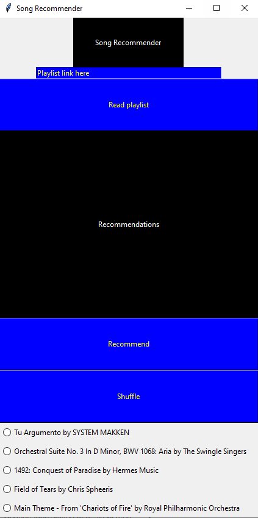

# Analyze songs from a playlist

This has a virtual environment folder.  Activate it with the following line
`venv\Scripts\activate`
then install dependencies with 
`pip3 install -r requirements.txt`

## recommender.py
This app recommends songs based off a song from a Spotify playlist.
To run it, 
`python recommender.py`

## playlist_analyzer.ipynb
This notebook file can be opened with the command
`jupyter-lab`
It processes playlist songs by its audio features.

When done, deactivate the venv with 
`deactivate`
or
`venv\Scripts\deactivate`

